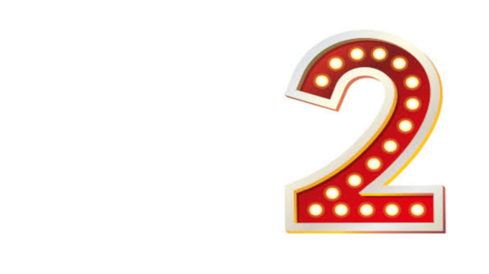
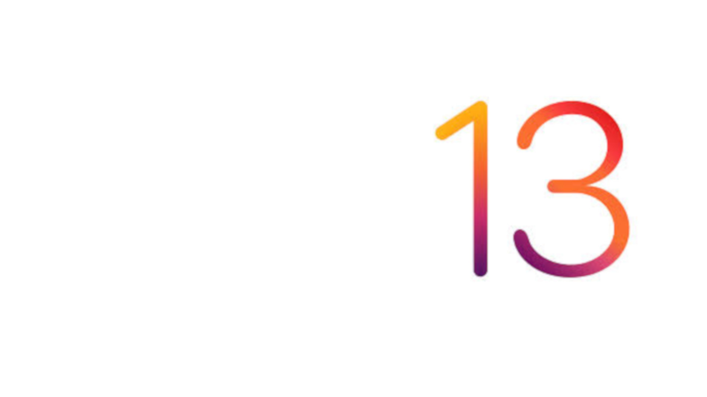

# ZoomPoker
## Planning Poker backgrounds for Zoom Meetings

Use these backgrounds to cast your vote for story points while planning in Zoom Meetings. This repo includes images both mirrored and non-mirrored. I use the mirrored images. I have also included the source image (ZoomPoker.xcf) that has a white background and a layer for each number.  

Non-mirrored background...  

Mirrored background...

